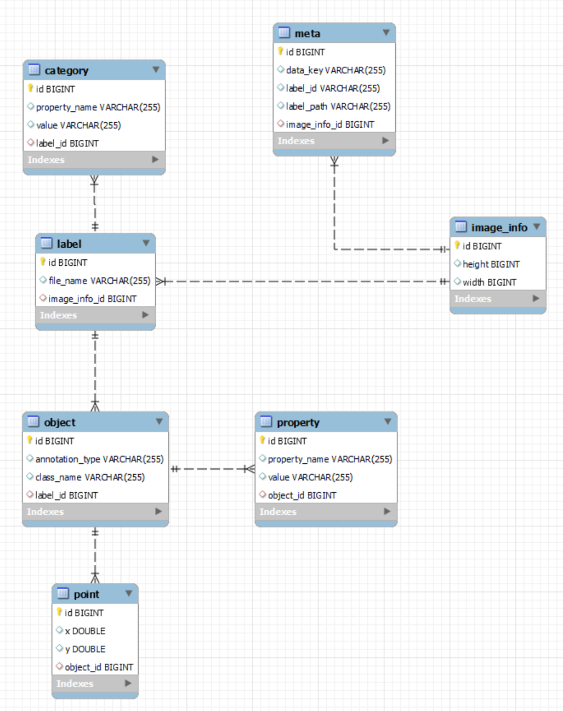
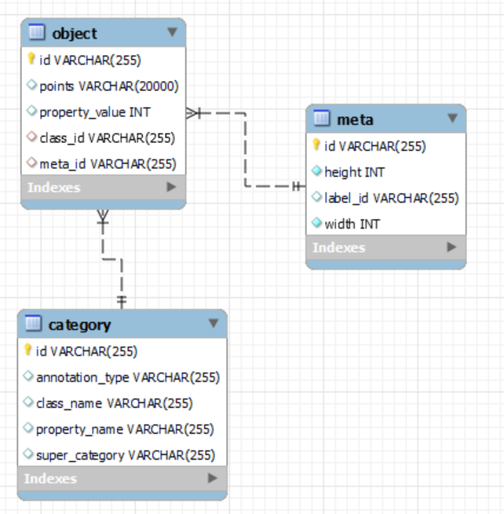

# springboot-json-to-db
(Prototype)Superb AI 라벨링 작업 파일을 DB에 저장, 필요 컬럼만 JSON 형식으로 리턴하는 기능

---
## 개발 기술
* `프레임워크` : `Spring Boot`
* `데이터 저장 계층` : `JPA`, `MySQL`
* `build` : `Gradle`

## 기능
* Superb AI Image 라벨링 작업 파일에서 필요한 Value DB에 저장
* 실제 데이터가 맞게 들어갔는지 확인하는 Script
* 시험적으로 2000장 DB에 저장 후 조회해보기
* 진행 플로우 그리기

## 사전 지식
* Class -> ex) Pen
* Object -> ex) Blue Pen , Red Pen 
* Instance -> ex) Blue Pen 1, Blue Pen 2 ...

## 개발 순서
### 1. `DB 연동 (MySQL)`
### - `ERD` 1차(수정)



### - `ERD` 2차


  * list를 DB에 저장할 경우 -> ex) `point`
    1. String으로 변환 후 저장 : 문자열이 길어지면 저장 못할 수 있음
    2. Table 하나 생성 후 Join : Join 쿼리 날리는 비용 계산
  * 최대한 테이블 하나에 몰아 넣고, 파티셔닝은 나중에 필요할 때
  * `Id`
    * 서로 계산하기 위해 선언하는 PK면, `INT`
    * 구분을 위한 PK면, `VARCHAR`로 선언하는 것이 좋음
  

### 2. `Entity` (domain)
   * 배열을 데이터베이스에 2가지 저장법
     1. 해당 데이터를 별도의 테이블을 구성하고, 쿼리문의 조인을 통해 DTO를 구성
     2. 배열 형태의 데이터를 통째로 `String`으로 변환 후 DB에 저장. 꺼낼 때는, `String`을 파싱하여`List`
   * `@Column(unique = true)`


### 3. `Repository`
   * `DB Table`들 간의 연관 관계 확인
   * <Strong><u>객체 연관 관계랑의 차이 존재</u></Strong>
   * `@OneToMany` - `@ManyToOne`
     * `MappedBy` : (좌)
     * `@JoinColumn` : (우)


### 4. `Controller`
   * `JSON` -> `@RequestBody HashMap<Object, Object> params`
   * `Service`로 전송
   * `Talend API tester`로 예시 파일 전송
   * `Folder Path` : `application.yml` 에 설정
   * `DTO` & `Domain`간의 변환 작업 시행?(`Service` 단에서 처리??)


### 5. `Service`
   * `Gson` : `Java`에서 `JSON`을 파싱하고, 생성하기 위해 구글에서 개발한 오픈소스
     * `Gradle`
        ```
        dependencies {
          implementation `com.google.code.gson:gson:2.8.7`
        }
        ```
   * `google-json-simple`
     * `JSONObject`
       * `JSON` 파일을 파싱하기 위해 JSONObject class의 `parse` Method
       * `File Reader` 객체를 전달
       * `get()` `Property` 명을 전달하여 값을 읽어옴.
     * `JSONArray`
       * 다건 JSON객체가 내부에 있을 떄, `JSONObject`와 반복 사용.
     * `JsonParser`
       * Json 내 Json 파싱

   * `File`
     * 폴더 내 파일 가져오기 시 사용.

   * `Double`형 `JSON Value` `Int` 형으로 파싱해서 저장
     1. `String` : 캐스팅 변환이 아닌 `String.valueof`로 형변환
     2. `Double` : 실수형으로 변환
     3. `Math.round()` : 소수점 반올림
     4. `Int` : 캐스팅 정수형 변환


### 6. 예외 처리
* `SQLIntegrityConstraintViolationException` : DB에러에 대해 Exception 처리 불가능 -> `DataIntegrityViolationException`
* `Transactional Rollback` : `@Transactional`이 걸려 있는 메서드 내부에서의 오류
  * `UnexpectedRollbackException` : DB에 값이 저장되지 않는 현상


### 7. `Swagger UI 연동`


### 8. DB 저장 용량 예상
* `Row` 당 `Size` 구하기
  * `category` : 25 -> 655 (Byte)  =  1 -> 26  =  54만장 -> 14.04 (MB)
  * `meta` : 26 -> 630 (Byte)  =  1 -> 24  =  54만장 -> 12.96 (MB)
  * `object` : 30 -> 1638 (Byte)  =  1 -> 54  =  54만장 -> 29.16 (MB)


* `analyze table ` : 인덱스를 재생성하여 성능을 최적화


### 9. `DTO`
* Data Transfer Object
* Controller -> Service -> Repository 간의 통신
* Service 계층에서 사용되는 잠재적인 설계 요소


* `Jackson Property` 
  * `@JsonIgnore` : `property`는 return 되지 않는다
  * `@JsonInclude` 
    * `ALWAYS` : 속성 값에 의존하지 말고 항상
    * `NOT_EMPTY` : null 또는 값이 빈 경우가 아니면 포함
    * `NOT_NULL` : null 아니면 포함
    * `NOT_DEFAULT` : `bean`의 기본 생성자로 정의된 필드값과 다르게 변경된 필드만
  * `@JsonProperty` : class의 property name을 바꿀 때


* `GSON`
  * Class를 직접 만들지 않고, 직접 JSON을 만들어 전송


* `@ResponseBody`
  * View Page가 아닌 반환값 그대로 클라이언트한테 return 하고 싶을 때


### 10. `Unit Test`
* `JUint` : 테스트 도구
* `@SpringBootTest` : 실제 DB와 connection 진행되는 Live Test 방법
* `Service`에서 JSON Value가 DB에 정확하게 들어갔는지 확인
## API 명세서
[Notion - 크라우드 소싱 웹 개발 API도 포함](https://shade-sled-bf2.notion.site/API-b11de231685246b49f97d96a4e6887da)
## 참고 자료
* [PK int형 vs varchar형 1 - stackoverflow](https://stackoverflow.com/questions/2103322/varchar-as-foreign-key-primary-key-in-database-good-or-bad%20)
* [PK int형 vs varchar형 2 - stackoverflow](https://stackoverflow.com/questions/3162202/sql-primary-key-integer-vs-varchar)
* [Folder Files 가져오기](https://codechacha.com/ko/java-list-files/)
* [Array in MySQL Databases - stackoverflow](https://stackoverflow.com/questions/10686333/save-array-in-mysql-database/32664559)
* [MySQL TEXT vs BLOB vs CLOB 성능 관점, 사용성 관점](https://stackoverflow.com/questions/7071662/mysql-text-vs-blob-vs-clob)
* [DB Row Size 구하는 쿼리](https://wizardee.tistory.com/146)
* [Analyze-Table doc](https://dev.mysql.com/doc/refman/5.6/en/analyze-table.html)
* [DTO의 사용 범위에 대하여](https://tecoble.techcourse.co.kr/post/2021-04-25-dto-layer-scope/)
* [DTO는 어느 레이어까지 사용하는 것이 맞을까?](https://www.slipp.net/questions/93)
* [Entity To DTO Conversion for a Spring REST API](https://www.baeldung.com/entity-to-and-from-dto-for-a-java-spring-application)