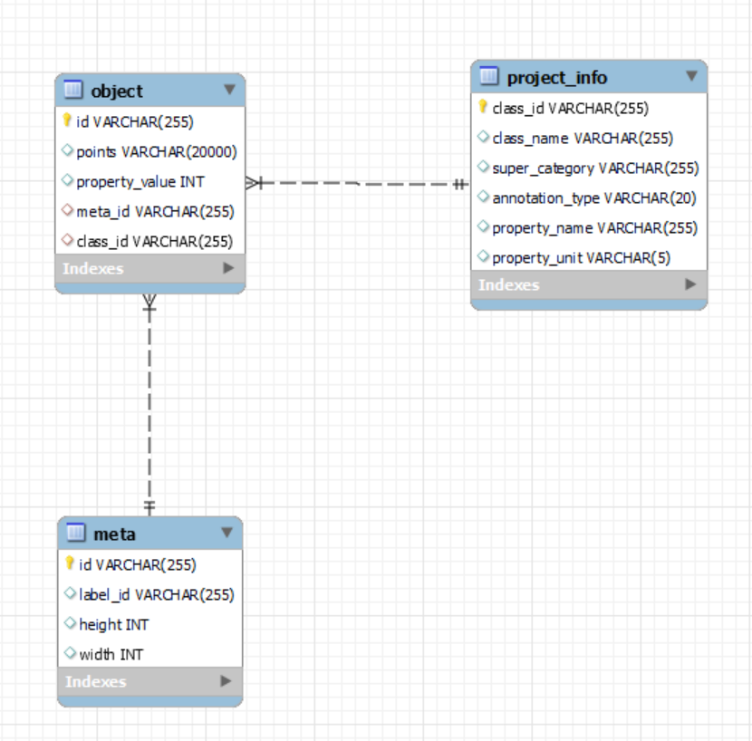

# springboot-json-to-db
(Prototype)Superb AI 이미지 라벨링 JSON 파일을 DB에 저장, 필요 컬럼만 조회하는 프로그램

## 개발 기술
* `프레임워크` : `Spring Boot`
* `데이터 저장 계층` : `JPA`, `MySQL`
* `build` : `Gradle`

## 기능
* Superb AI Image 라벨링 작업 파일에서 필요한 Value DB에 저장
* 실제 데이터가 맞게 들어갔는지 확인하는 Script
* 시험적으로 3000장 DB에 저장
  * 각 테이블의 DB Size 예상
  * 저장 후 JSON 파일로 재조회해보기
* [진행 플로우 그리기](https://github.com/YoungGyo-00/springboot-json-to-db/tree/master/artifacts/docs_managements)

## 사전 지식
* Class -> ex. Pen
* Object -> ex. Blue Pen , Red Pen 
* Instance -> ex. Blue Pen 1, Blue Pen 2 ...

## 개발 순서
### 1. `DB 연동 (MySQL)`
### - `ERD` 1차(수정)


### - `ERD` 2차


  * list DB에 저장할 경우 -> ex) `point`
    1. String 변환 후 저장 : 문자열이 길어지면 저장 못할 수 있음
    2. Table 하나 생성 후 Join : Join 쿼리 날리는 비용 계산
  * 최대한 테이블 하나에 몰아 넣고, 파티셔닝은 나중에 필요할 때
  * `Id`
    * 서로 계산하기 위해 선언하는 PK면, `INT`
    * 구분을 위한 PK면, `VARCHAR`로 선언하는 것이 좋음
  

### 2. `Entity` (domain)
   * 배열을 데이터베이스에 2가지 저장법
     1. 해당 데이터를 별도의 테이블을 구성하고, 쿼리문의 조인을 통해 DTO 구성
     2. 배열 형태의 데이터를 통째로 `String`으로 변환 후 DB에 저장. 꺼낼 때는, `String`을 파싱하여`List`
   * `@Column(unique = true)`


### 3. `Repository`
   * `DB Table`들 간의 연관 관계 확인
   * <Strong><u>객체 연관 관계랑의 차이 존재</u></Strong>
   * `@OneToMany` - `@ManyToOne`
     * `MappedBy` : (좌)
     * `@JoinColumn` : (우)


### 4. `Controller`
   * `JSON` -> `@RequestBody HashMap<Object, Object> params`
   * `Service`로 전송
   * `Talend API tester`로 예시 파일 전송
   * `Folder Path` : `application.yml` 에 설정
   * `DTO` & `Domain`간의 변환 작업 시행?(`Service` 단에서 처리??)


### 5. `Service`
   * `Gson` : `Java`에서 `JSON`을 파싱하고, 생성하기 위해 구글에서 개발한 오픈소스
     * `Gradle`
        ```
        dependencies {
          implementation `com.google.code.gson:gson:2.8.7`
        }
        ```
   * `google-json-simple`
     * `JSONObject`
       * `JSON` 파일을 파싱하기 위해 JSONObject class `parse` Method
       * `File Reader` 객체를 전달
       * `get()` `Property` 명을 전달하여 값을 읽어옴.
     * `JSONArray`
       * 다건 JSON 객체가 내부에 있을 떄, `JSONObject`와 반복 사용.
     * `JsonParser`
       * Json 내 Json 파싱

   * `Files.walk(path)`
     * path 에는 String 아닌 `Path` 인터페이스 객체를 파라미터로 받음
     * `Path` 객체는 `Paths.get(String)`으로 얻을 수 있음
     * 

   * `Double`형 `JSON Value` `Int` 형으로 파싱해서 저장
     1. `String` : 캐스팅 변환이 아닌 `String.valueof`로 형변환
     2. `Double` : 실수형으로 변환
     3. `Math.round()` : 소수점 반올림
     4. `Int` : 캐스팅 정수형 변환


### 6. 예외 처리
* `SQLIntegrityConstraintViolationException` : DB error 대해 Exception 처리 불가능 -> `DataIntegrityViolationException`
* `Transactional Rollback` : `@Transactional`이 걸려 있는 메서드 내부에서의 오류
  * `UnexpectedRollbackException` : DB에 값이 저장되지 않는 현상
* Controller 반복적인 예외 처리를 피하기 위해
  * `@ExceptionHandler` : @Controller, @RestController 적용된 Bean 내에서 예외를 하나의 메서드에서 처리
  * `@ControllerAdvice` : @Controller 전역에서 발생할 수 있는 예외 잡기
  * `@RestControllerAdvice` : Status 반환할 수 있음

### 7. `Swagger UI 연동`
* `@ApiOperation` : API 설명 참조
  * `value` : API 옆에 설명
  * `note` : 세부 설명


### 8. DB 저장 용량 예상
```mysql
SELECT TABLE_NAME "Tables",
    ROUND((TABLE_ROWS / 1000), 3) "Rows (K)",
    AVG_ROW_LENGTH "Row Size (Byte)",
    ROUND((DATA_LENGTH / 1024 / 1024), 3) "Data Size (MB)",
    ROUND((INDEX_LENGTH / 1024 / 1024), 3) "Index Size (MB)",
    ROUND(((DATA_LENGTH + INDEX_LENGTH) / 1024 / 1024), 3) "Total Size (MB)"
FROM INFORMATION_SCHEMA.TABLES
WHERE TABLE_SCHEMA = "json_to_db"
ORDER BY (DATA_LENGTH + INDEX_LENGTH) DESC;

analyze table object;
analyze table project_info;
analyze table meta;
```
* `Row` 당 `Size` 구하기 (기준. 20 폴더 : 3076 files, project : 612 개, object : 7069 개 )
  * `project` 
    * time : 1.3s   =  4분 예상
    * size : 0.109 MB  =  18 MB
  * `meta` 
    * time : 1m 3s   =  3시간 예상
    * size : 0.766 MB   = 134 MB
  * `object`
    * time : 4m 5s   =  12.5시간 예상
    * size : 10.578 MB  = 1.8 GB ?_?


* `analyze table ` : 인덱스를 재생성하여 성능을 최적화


### 9. `DTO`
* Data Transfer Object
* Controller -> Service -> Repository 간의 통신
* Service 계층에서 사용되는 잠재적인 설계 요소


* `Jackson Property` 
  * `@JsonIgnore` : `property`는 return 되지 않는다
  * `@JsonInclude` 
    * `ALWAYS` : 속성 값에 의존하지 말고 항상
    * `NOT_EMPTY` : null 또는 값이 빈 경우가 아니면 포함
    * `NOT_NULL` : null 아니면 포함
    * `NOT_DEFAULT` : `bean`의 기본 생성자로 정의된 필드값과 다르게 변경된 필드만
  * `@JsonProperty` : class property name 바꿀 때


* `GSON`
  * Class 직접 만들지 않고, 직접 JSON 만들어 전송


* `@ResponseBody`
  * View Page 아닌 반환값 그대로 클라이언트한테 return 하고 싶을 때


* `MapStruct`
  * 엔티티와 DTO 간에 변환할 때 자동 매핑 라이브러리
  * `ModelMapper`보다 매핑 속도가 빠름
  
### 10. `Unit Test`
* `JUint` : 테스트 도구
* `@SpringBootTest` : 실제 DB와 connection 진행되는 Live Test 방법
* `Service`에서 JSON Value DB에 정확하게 들어갔는지 확인
* `Mockmvc`
* <u>실행 오류</u>
  * [java.lang.IllegalStateException: Failed to retrieve PlatformTransactionManager for @Transactional test](https://velog.io/@hanblueblue/%ED%94%84%EB%A1%9C%EC%A0%9D%ED%8A%B83-4.-%EB%B2%84%EA%B7%B8-%EC%88%98%EC%A0%95)
  * [@WebMvcTest 단위 테스트 시 Bean 주입 에러](https://velog.io/@gillog/SpringBoot-WebMvcTest-%EB%8B%A8%EC%9C%84-%ED%85%8C%EC%8A%A4%ED%8A%B8%EC%8B%9C-Bean-%EC%A3%BC%EC%9E%85-%EC%97%90%EB%9F%AC)
  

## 높고 높은 벽..
* Spring JPA Auto DDL generation 실행하면, 알파벳 순서로 정렬..
  * DB Column 순서 또한 중요한 점을 고려하여, 문제점으로 분류
  * JPA 사용하면 하이버네이트가 자동으로 테이블 생성
  * 이는 실제 배포 단계에서 위험
  * <Strong>개념과 해결 방법 서치..</Strong>
    * `DDL generation`
      1. `@Entity` 클래스 찾기
      2. `spring.jpa.generate-ddl=true` 옵션 적용시 자동 생성
    * `SQL script`
      * Spring 기본값으로 classpath 루트에 `schema.sql`파일이 있다면, 서버 시작시 스크립트를 실행
      * `schema.sql` -> DDL script 명시
      * `data.sql` -> Data 위한 DML 명시
      * JPA 기반의 애플리케이션을 만든다면, `schema.sql` or `hibernate.ddl-auto` 둘 중 하나만
      * `schema.sql` -> db 폴더 생성 후 저장
    * profile 파일 분리
      * 개발 단계에서 dev profile 활성화, 배포할 때는 real profile 활성화
      * 이는 `application.yml`에서 관리


* List 합치기.. Stream 사용 List 합치기.. list 안에 list 있을 때.. => Controller 함수 재사용하기 위함..
  1. addAll() -> list 합치기
  2. concat() -> stream 합치기
  3. flatMap() -> list 안에 list 합치기
  
## 3000개 파일 저장 시에 발생한 예외 상황
* Object property value 가 `empty` or `null` 인 경우가 존재함
    * `empty` -> -1 로 일단 대체
    * `null`  -> -2 로 일단 대체
  
* Meta 30XX A30049099001TNV030O001LV.jpg 값이 안 들어가 있어서 오류

* `javax.persistence.NonUniqueResultException: query did not return a unique result: 2`
  * JPA Repository 쿼리 값이 1개가 아닌 복수 개가 넘어오는 경우
  * limit 설정으로 첫 번째 값만 불러오기로 일단은 해결

## 더 공부가 필요한 부분
* Custom Exception Handling + ResponseEntity
* Stream
* Mockmvc + Unit Test 방법
* DB size 측정 기준 및 파티셔닝 기준 + 성능 측면
* slf4j

## 추가 링크
* [프로젝트 관리를 위한 문서들](https://github.com/YoungGyo-00/springboot-json-to-db/tree/master/artifacts/docs_managements)
* [프로젝트 진행 시 참고했던 자료를 관리하는 폴더](https://github.com/YoungGyo-00/springboot-json-to-db/blob/master/artifacts/docs_references/REAMDE.md)