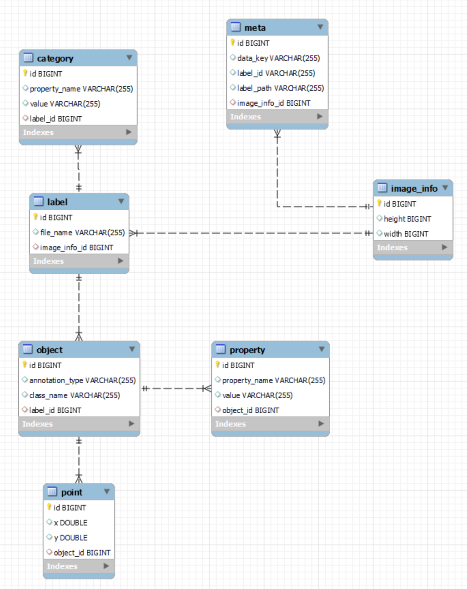
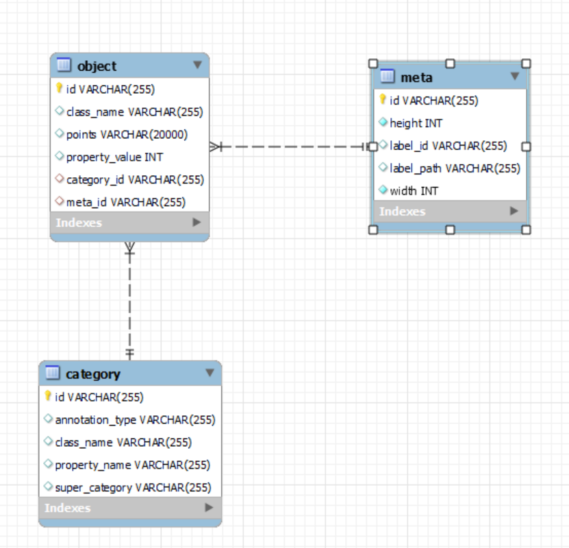

# springboot-json-to-db
Superb AI 라벨링 작업 파일을 DB에 저장, 필요 컬럼만 JSON으로 돌리는 기능

---
## 개발 기술
* `프레임워크` : `Spring Boot`
* `데이터 저장 계층` : `JPA`, `MySQL`
* `build` : `Gradle`

## 사전 지식
* Class -> ex) Pen
* Object -> ex) Blue Pen , Red Pen 
* Instance -> ex) Blue Pen 1, Blue Pen 2 ...

## 개발 순서
1. `DB 연동 (MySQL)`
* `ERD` 1차



* `ERD` 2차


2. `Entity` (domain)
   * 배열을 데이터베이스에 2가지 저장법
     1. 해당 데이터를 별도의 테이블을 구성하고, 쿼리문의 조인을 통해 DTO를 구성
     2. 배열 형태의 데이터를 통째로 `String`으로 변환 후 DB에 저장. 꺼낼 때는, `String`을 파싱하여`List`
   * `@Column(unique = true)`


3. `Repository`
   * `DB Table`들 간의 연관 관계 확인
   * <Strong><u>객체 연관 관계랑의 차이 존재</u></Strong>
   * `@OneToMany` - `@ManyToOne`
     * `MappedBy` : (좌)
     * `@JoinColumn` : (우)


4. `Controller`
   * `JSON` -> `@RequestBody HashMap<Object, Object> params`
   * `Service`로 전송
   * `Talend API tester`로 예시 파일 전송
   * `Folder Path` : `application.yml` 에 설정
   

5. `Service`
   * `Gson` : `Java`에서 `JSON`을 파싱하고, 생성하기 위해 구글에서 개발한 오픈소스
     * `Gradle`
        ```
        dependencies {
          implementation `com.google.code.gson:gson:2.8.7`
        }
        ```
   * `google-json-simple`
     * `JSONObject`
       * `JSON` 파일을 파싱하기 위해 JSONObject class의 `parse` Method
       * `File Reader` 객체를 전달
       * `get()` `Property` 명을 전달하여 값을 읽어옴.
     * `JSONArray`
       * 다건 JSON객체가 내부에 있을 떄, `JSONObject`와 반복 사용.
     * `JsonParser`
       * Json 내 Json 파싱

   * `File`
     * 폴더 내 파일 가져오기 시 사용.


6. `예외 처리`
* `SQLIntegrityConstraintViolationException` : DB에러에 대해 Exception 처리 불가능 -> `DataIntegrityViolationException`
* `Transactional Rollback` : `@Transactional`이 걸려 있는 메서드 내부에서의 오류
  * `UnexpectedRollbackException` : DB에 값이 저장되지 않는 현상

## 참고 자료
* [PK int형 vs varchar형 1 - stackoverflow](https://stackoverflow.com/questions/2103322/varchar-as-foreign-key-primary-key-in-database-good-or-bad%20)
* [PK int형 vs varchar형 2 - stackoverflow](https://stackoverflow.com/questions/3162202/sql-primary-key-integer-vs-varchar)
* [Folder Files 가져오기](https://codechacha.com/ko/java-list-files/)
* [Array in MySQL Databases - stackoverflow](https://stackoverflow.com/questions/10686333/save-array-in-mysql-database/32664559)
* [MySQL TEXT vs BLOB vs CLOB 성능 관점, 사용성 관점](https://stackoverflow.com/questions/7071662/mysql-text-vs-blob-vs-clob)